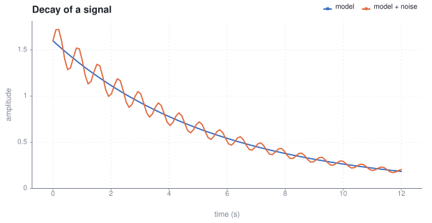
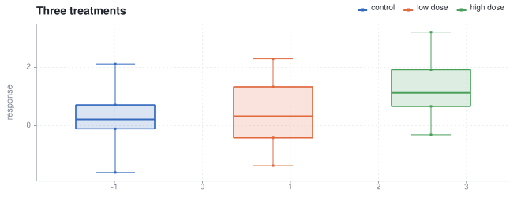
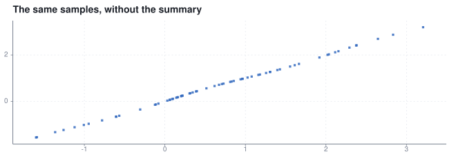
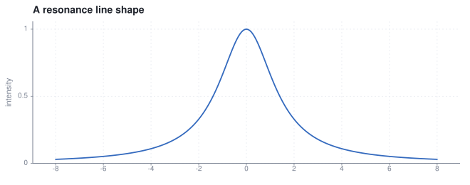
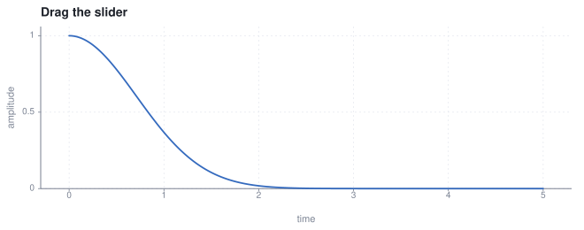
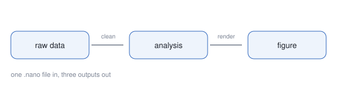

# Getting to know nano

*One file, three outputs, zero dependencies*

*Ada Researcher*

2026-02-14

> A tour of the nano document language. Prose, runnable code, data, charts, math and media live in the same file, and build to Markdown, HTML and PDF.

**Keywords:** nano, research, literate, plotting, pdf

# Getting to know nano <a id="getting-to-know-nano"></a>

A `.nano` file is a **research document**, not a program that happens to print
text. Prose, code, data, figures and citations are the same document, so there
is nothing to keep in sync and nothing to export by hand.

## Contents

- [The shape of a document](#the-shape-of-a-document)
- [Charts are one block](#charts-are-one-block)
- [Functions without ceremony](#functions-without-ceremony)
- [Interactive figures](#interactive-figures)
- [Data in tables](#data-in-tables)
- [Math, notes and media](#math-notes-and-media)
- [Where to go next](#where-to-go-next)

## The shape of a document <a id="the-shape-of-a-document"></a>

Anything you can write in Markdown works here, because Markdown is a subset.
Two things are added: fenced code blocks that **run**, and directives that
start with `@`.

```nano
let girth = [1.2, 1.6, 1.9, 2.3, 2.8, 3.1]
let mass  = [7.1, 12.4, 17.9, 24.2, 31.0, 38.4]

"n = {len(girth)}"
```

```text
n = 6
```

The value of the last expression in a cell is printed under it, and anything
`print` output is captured too. The sample is small: mean girth 2.15,
and the coefficient of variation of mass is
0.536.

> [!NOTE]
> Cells share one scope, top to bottom, exactly like a notebook. A variable
> defined in cell 4 is available in cell 40, and in every `@plot` below it.

## Charts are one block <a id="charts-are-one-block"></a>

A plot is a directive with `key = expression` lines. Data lives in the language,
so you compute it, then draw it.

```nano
let t     = linspace(0, 12, 120)
let calm  = map(t, fn(x) => 1.6 * exp(-0.18 * x))
let noisy = map(t, fn(x) => round(calm[min(floor(x * 10), len(calm) - 1)] * (1 + 0.12 * sin(9 * x)), 4))
```



*An exponential model with additive structure. Both series are computed in the cell above.*

Every chart type works: `line`, `scatter`, `area`, `step`, `bar`, `hbar`,
`hist`, `box`, `heatmap`, `errorbar`, `function`, `stem`, `density`.

```nano
seed(7)
let groups = ["control", "low dose", "high dose"]
let values = [randn(22), map(randn(22), fn(v) => v + 0.6), map(randn(22), fn(v) => v + 1.3)]
```



*Box plots of 22 samples per arm.*



## Functions without ceremony <a id="functions-without-ceremony"></a>

```nano
fn lorentz(x, gamma) {
  gamma / (pi * (x * x + gamma * gamma))
}

let half_width = lorentz(_, 0.7)
let xs = linspace(-6, 6, 400)
let ys = map(xs, half_width)

"peak = {round(max(ys), 3)}, near x = {round(xs[index_of(ys, max(ys))], 2)}"
```

```text
peak = 0.455, near x = -0.02
```



*Plot formulas are evaluated by a small expression language that ships with the document.*

> [!WARNING]
> Formula plots can be made interactive. Declare a widget, bind it, and the
> figure redraws live in HTML while Markdown and PDF keep the initial value.

## Interactive figures <a id="interactive-figures"></a>

**damping rate** `t` = 0.9 (slider, 0.1 – 3, step 0.05)



Current damping rate: <span data-var-readout="t">0.9</span>

## Data in tables <a id="data-in-tables"></a>

| sample | girth | mass | ratio |
| :--- | :--- | :--- | :--- |
| 1 | 1.2 | 7.1 | 5.92 |
| 2 | 1.6 | 12.4 | 7.75 |
| 3 | 1.9 | 17.9 | 9.42 |
| 4 | 2.3 | 24.2 | 10.52 |
| 5 | 2.8 | 31 | 11.07 |
| 6 | 3.1 | 38.4 | 12.39 |

*The same numbers, in a table.*

Records and grouping work too:

```nano
let rows = [
  {site: "north", temp: 4.1, n: 88},
  {site: "north", temp: 6.3, n: 91},
  {site: "south", temp: 19.8, n: 74},
  {site: "south", temp: 21.2, n: 70}
]

let by_site = group_by(rows, fn(r) => r.site)
"mean temp, south = {round(mean(map(by_site.south, fn(r) => r.temp))), 1)}"
```

```text
mean temp, south = 21
```

| site | n | mean temp |
| :--- | :--- | :--- |
| north | 2 | 5.2 |
| south | 2 | 20.5 |

*Grouped by site.*

## Math, notes and media <a id="math-notes-and-media"></a>

$$
\hat{\beta} = (X^{\top} X)^{-1} X^{\top} y
$$

Inline math such as $e^{i\pi} + 1 = 0$ is typeset in the browser by a small
built-in TeX renderer — no MathJax, no network, no build step. Display math
works too:

$$
\int_{-\infty}^{\infty} e^{-x^2}\,dx = \sqrt{\pi}
$$

> [!TIP]
> `@note`, `@tip`, `@warning` and `@info` all render as callout panels in
> every output format.



*Images are embedded in HTML and PDF, and copied alongside the Markdown.*

[Audio: A short tone (placeholder asset).](assets/tone.wav)

*A short tone (placeholder asset).*

[Embed: https://example.org/reference](https://example.org/reference)

*External reference, embedded as an iframe in HTML.*

## Where to go next <a id="where-to-go-next"></a>

> [!TIP]
> The full language reference lives in `docs/language.md`, and a task-oriented
> walkthrough lives in `docs/guide.md`. `nano build paper.nano -f pdf`
> writes one file; `-f all` writes Markdown, HTML and PDF side by side.
